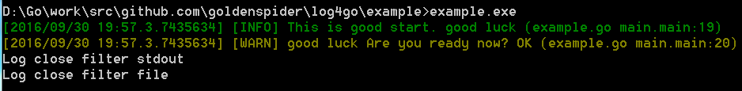

# log4go
Please see http://log4go.googlecode.com/

Installation:

- Run `go get github.com/goldenspider/log4go`

- Run `go install github.com/goldenspider/log4go`

# Example
```go
package main

import (
	. "github.com/goldenspider/log4go"
)

func main() {
	//default use config.toml from current dir
	//console and file
	//StartLogServer("config.toml")

	StartLogServer()
	defer StopLogServer()

	LogInfof("This is good start. %s", "Yes")
	LogWarn("Are you ready now? ", "OK")
}
```
## output


